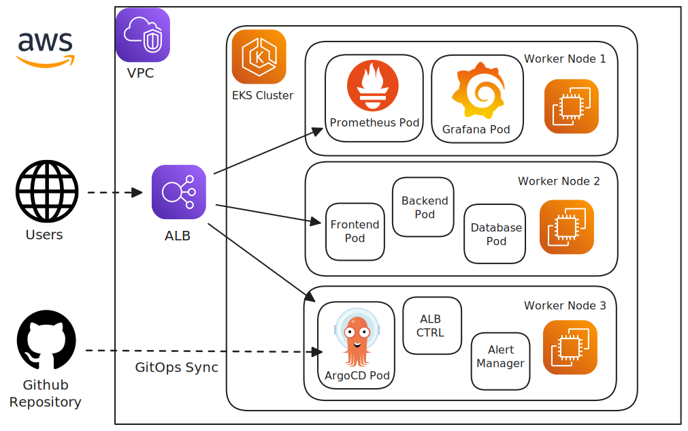

# Enterprise EKS Multi-Tier Application with GitOps

A production-ready EKS deployment showcasing AWS best practices, GitOps workflows, and comprehensive monitoring.

## Architecture


_Architecture diagram created using AWS official icons and Excalidraw_

## Features

- **Infrastructure as Code**: Terraform for EKS cluster provisioning
- **GitOps Deployment**: ArgoCD for automated application deployment
- **Multi-Tier Application**: React frontend, Node.js API, PostgreSQL database
- **Helm Charts**: Templated Kubernetes manifests with environment-specific values
- **Monitoring Stack**: Prometheus metrics collection and Grafana dashboards
- **Auto-scaling**: HPA and Cluster Autoscaler implementation
- **Security**: RBAC, Network Policies, and AWS IAM integration
- **Cost Optimization**: Spot instances and resource right-sizing

## Project Structure

```
├── infrastructure/          # Terraform IaC
├── helm-charts/            # Application Helm charts
├── argocd/                 # GitOps configuration
├── monitoring/             # Prometheus & Grafana setup
├── applications/           # Source code for demo apps
└── docs/                   # Documentation
```

## Technologies

- **Infrastructure**: Terraform, AWS EKS, VPC, IAM
- **Container Orchestration**: Kubernetes, Helm
- **GitOps**: ArgoCD
- **Monitoring**: Prometheus, Grafana, AlertManager
- **Applications**: React, Node.js, PostgreSQL
- **CI/CD**: GitHub Actions

## Prerequisites

- AWS CLI configured with appropriate permissions
- Terraform >= 1.0
- kubectl
- Helm >= 3.0
- Docker

## Quick Start

1. **Deploy Infrastructure**

   ```bash
   cd infrastructure
   terraform init
   terraform plan
   terraform apply
   ```

2. **Install ArgoCD**

   ```bash
   kubectl create namespace argocd
   kubectl apply -n argocd -f https://raw.githubusercontent.com/argoproj/argo-cd/stable/manifests/install.yaml
   ```

3. **Deploy Applications via GitOps**
   ```bash
   kubectl apply -f argocd/applications/
   ```

## Monitoring

Access Grafana dashboard at: `http://grafana.your-domain.com`

Default dashboards include:

- Cluster overview and resource utilization
- Application performance metrics
- Cost monitoring and optimization insights

## Security Features

- RBAC with least privilege access
- Network policies for pod-to-pod communication
- AWS IAM roles for service accounts (IRSA)
- Secrets management with AWS Secrets Manager
- Container image scanning

## Cost Optimization

- Spot instances for non-critical workloads
- Cluster autoscaler for dynamic scaling
- Resource requests and limits optimization
- Scheduled scaling for predictable workloads

## Learning Outcomes

This project demonstrates:

- Modern cloud-native application deployment
- Infrastructure as Code best practices
- GitOps workflow implementation
- Kubernetes production readiness
- AWS cost optimization strategies
- Comprehensive monitoring and observability

---

**Author**: [Your Name]  
**Purpose**: Portfolio project showcasing enterprise EKS deployment patterns
