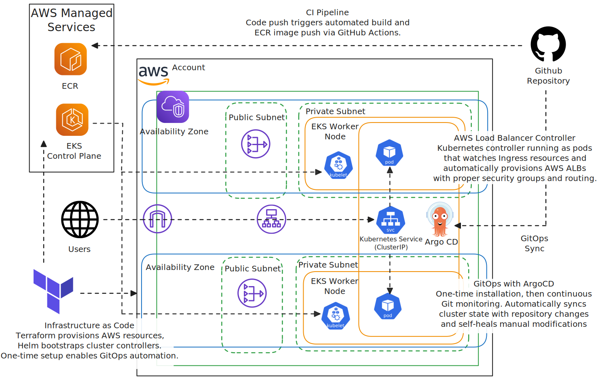

# Enterprise EKS Multi-Tier Application with GitOps

[](https://www.terraform.io/)
[](https://aws.amazon.com/eks/)
[](LICENSE)
[](https://github.com/Simodalstix/AWS-eks-multi-tier-gitops/releases)
[](https://github.com/Simodalstix/AWS-eks-multi-tier-gitops/actions)

Production-ready Terraform infrastructure for EKS with GitOps, showcasing AWS best practices and enterprise deployment patterns.

## What's Provisioned

**AWS Infrastructure:**
- VPC with public/private subnets across 3 AZs
- EKS cluster with managed node groups (spot instances)
- Application Load Balancer with target-type: ip
- ECR repositories for container images
- IAM roles with IRSA for service accounts
- NAT Gateway for private subnet internet access

**Kubernetes Stack:**
- ArgoCD for GitOps deployment
- AWS Load Balancer Controller
- Cluster Autoscaler
- Prometheus & Grafana monitoring

## Architecture


_Architecture diagram created using AWS official icons and Excalidraw_

## Features

- **Infrastructure as Code**: Terraform for EKS cluster provisioning
- **GitOps Deployment**: ArgoCD for automated application deployment
- **Multi-Tier Application**: React frontend, Node.js API, PostgreSQL database
- **Helm Charts**: Templated Kubernetes manifests with environment-specific values
- **Monitoring Stack**: Prometheus metrics collection and Grafana dashboards
- **Auto-scaling**: HPA and Cluster Autoscaler implementation
- **Security**: RBAC, Network Policies, and AWS IAM integration
- **Cost Optimization**: Spot instances and resource right-sizing

## Project Structure

```
├── infrastructure/          # Terraform IaC for EKS cluster
├── helm-charts/            # Kubernetes application templates
├── argocd/                 # GitOps configuration
├── monitoring/             # Prometheus & Grafana setup
├── scripts/                # Deployment automation
└── docs/                   # Architecture & deployment guides
```

## Technologies

- **Infrastructure**: Terraform, AWS EKS, VPC, IAM
- **Container Orchestration**: Kubernetes, Helm
- **GitOps**: ArgoCD
- **Monitoring**: Prometheus, Grafana, AlertManager
- **Applications**: React, Node.js, PostgreSQL
- **CI/CD**: GitHub Actions

## Prerequisites

- AWS CLI configured with appropriate permissions
- Terraform >= 1.0
- kubectl
- Helm >= 3.0
- Docker

## Quick Start

### 1. Configure Variables
```bash
cp infrastructure/terraform.tfvars.example infrastructure/terraform.tfvars
# Edit with your values: region, project name, owner
```

### 2. Deploy Infrastructure
```bash
cd infrastructure
terraform init
terraform plan
terraform apply
```

### 3. Setup GitOps
```bash
# Configure kubectl
aws eks update-kubeconfig --region ap-southeast-2 --name eks-portfolio-dev

# Run setup script
./scripts/setup-argocd.sh
```

### Remote State (Production)
For production deployments, configure S3 backend:
```hcl
terraform {
  backend "s3" {
    bucket         = "your-terraform-state-bucket"
    key            = "eks-project/terraform.tfstate"
    region         = "ap-southeast-2"
    dynamodb_table = "terraform-locks"
    encrypt        = true
  }
}
```

## Monitoring

Access Grafana dashboard at: `http://grafana.your-domain.com`

Default dashboards include:

- Cluster overview and resource utilization
- Application performance metrics
- Cost monitoring and optimization insights

## Security Features

- RBAC with least privilege access
- Network policies for pod-to-pod communication
- AWS IAM roles for service accounts (IRSA)
- Secrets management with AWS Secrets Manager
- Container image scanning

## Cost Optimization

- Spot instances for non-critical workloads
- Cluster autoscaler for dynamic scaling
- Resource requests and limits optimization
- Scheduled scaling for predictable workloads

## Deployment Considerations

**Region & Costs:**
- Default region: `ap-southeast-2` (Sydney)
- Estimated cost: ~$150-200/month (EKS cluster + EC2 nodes + ALB)
- Spot instances enabled for 60-90% cost savings
- Single NAT Gateway for cost optimization

**IAM & Security:**
- Least privilege IAM roles via IRSA
- Private subnets for worker nodes
- Network policies for pod-to-pod communication
- Container image scanning enabled

**Tagging Strategy:**
```hcl
default_tags = {
  Project     = "eks-portfolio"
  Environment = "dev"
  ManagedBy   = "Terraform"
  Owner       = "your-name"
}
```

## Why This Matters

- **Resilience**: Multi-AZ deployment with auto-scaling
- **Cost Control**: Spot instances, right-sizing, lifecycle policies
- **Observability**: Comprehensive monitoring and logging
- **Security**: Network isolation, RBAC, secrets management
- **Automation**: GitOps workflow reduces manual errors

## Learning Outcomes

This project demonstrates:
- Modern cloud-native application deployment
- Infrastructure as Code best practices
- GitOps workflow implementation
- Kubernetes production readiness
- AWS cost optimization strategies
- Comprehensive monitoring and observability

---

**License**: MIT  
**Purpose**: Portfolio project showcasing enterprise EKS deployment patterns
